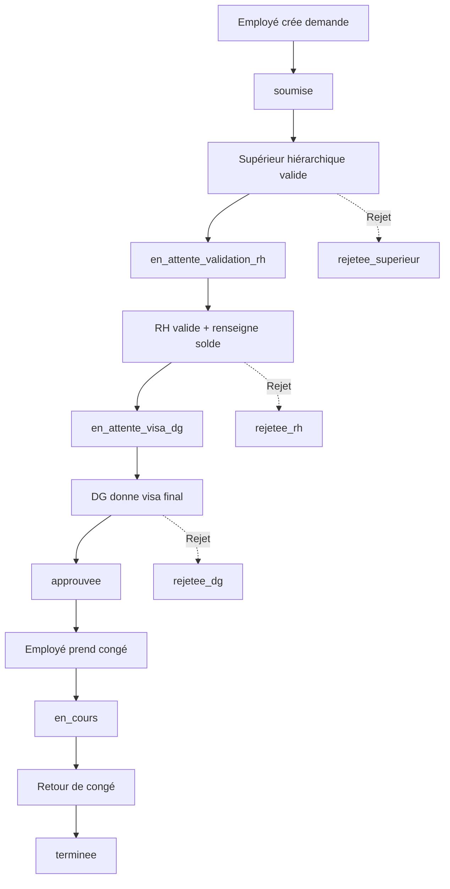
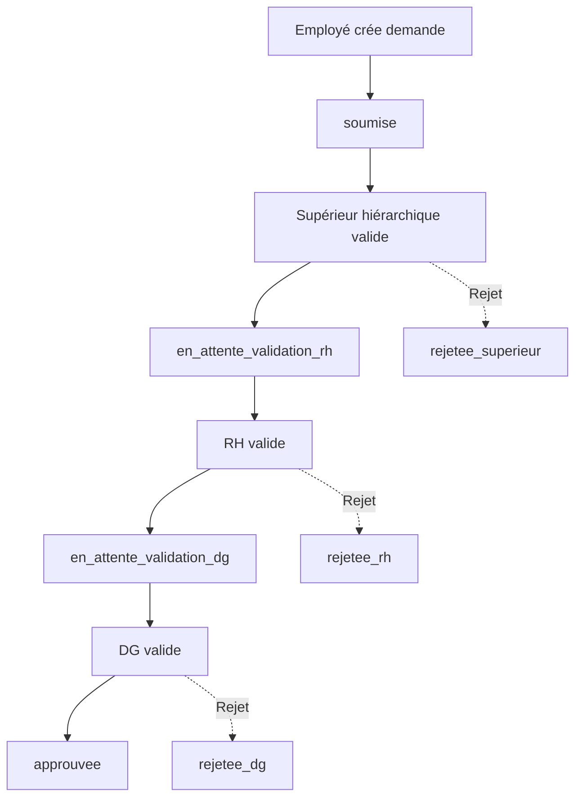

# 📋 Documentation - Rôles Directeur Général et Responsable RH

## 🎯 Vue d'Ensemble

Ce document décrit l'implémentation complète des rôles **Directeur Général (DG)** et **Responsable RH** dans l'application de gestion des demandes.

---

## 👔 Directeur Général (directeur_general)

### Permissions et Accès

#### ✅ Privilèges Administrateur Automatiques
- Le DG reçoit **automatiquement les privilèges administrateur** lors de la création de son compte
- Peut créer et gérer des projets
- Peut assigner des utilisateurs aux projets
- Peut modifier les rôles des autres utilisateurs

#### 📊 Dashboard
- **Dashboard identique au Super Admin** avec accès complet à :
  - Statistiques globales de l'entreprise
  - Vue d'ensemble de toutes les demandes (matériel, outillage, congés, absences)
  - Gestion des utilisateurs et projets
  - Rapports financiers et analytiques
  - Historique complet des validations

#### 🏖️ Système de Congés
Le DG intervient dans le workflow des congés :

**Étape de validation :**
- **Après le Responsable RH**
- Statut : `en_attente_visa_dg`

**Permissions :**
- ✅ Donne le **visa final** sur les demandes de congés
- ✅ Peut **modifier les dates** approuvées par le RH
- ✅ Peut **rejeter** une demande déjà validée par le RH
- ✅ Voit **toutes les demandes de congés** de l'entreprise

**Workflow complet :**
```
1. Employé soumet → soumise
2. Supérieur hiérarchique valide → en_attente_validation_rh
3. RH valide et renseigne solde → en_attente_visa_dg
4. DG donne visa final → approuvee
5. Employé prend son congé → en_cours
6. Retour de congé → terminee
```

#### 📋 Système d'Absences
Le DG intervient dans le workflow des absences :

**Étape de validation :**
- **Après le Responsable RH**
- Nouveau statut à implémenter : `en_attente_validation_dg`

**Permissions :**
- ✅ Valide les demandes d'absence après le RH
- ✅ Peut **être supérieur hiérarchique** dans une demande d'absence
- ✅ Peut modifier ou rejeter les demandes

**Workflow proposé :**
```
1. Employé soumet → soumise
2. Supérieur hiérarchique valide → en_attente_validation_rh
3. RH valide → en_attente_validation_dg
4. DG valide → approuvee
```

#### 🔧 Système Matériel/Outillage
- **Accès en lecture seule** pour supervision
- Peut consulter toutes les demandes
- **Ne participe pas** au workflow de validation
- Peut voir les statistiques et rapports financiers

---

## 👥 Responsable RH (responsable_rh)

### Permissions et Accès

#### 📊 Dashboard
- **Dashboard basé sur celui de l'employé** avec fonctionnalités supplémentaires :
  - Ses propres demandes (matériel, outillage) comme un employé
  - Section spéciale pour la gestion des congés
  - Section spéciale pour la gestion des absences
  - Statistiques RH (soldes de congés, absences)

#### 🏖️ Système de Congés
Le RH est un acteur clé dans le workflow des congés :

**Étape de validation :**
- **Après le supérieur hiérarchique**
- Statut : `en_attente_validation_rh`

**Permissions :**
- ✅ Valide les demandes de congés
- ✅ Peut **modifier les dates** proposées
- ✅ **Renseigne le solde de jours restants** après congé
- ✅ Voit **toutes les demandes de congés** de l'entreprise
- ✅ Peut rejeter une demande avec motif

**Workflow :**
```
1. Employé soumet → soumise
2. Supérieur hiérarchique valide → en_attente_validation_rh
3. RH valide et renseigne solde → en_attente_visa_dg
4. DG donne visa final → approuvee
```

#### 📋 Système d'Absences
Le RH gère les demandes d'absence :

**Étape de validation :**
- **Après le supérieur hiérarchique**
- Statut actuel : validation finale
- Nouveau workflow : avant le DG

**Permissions :**
- ✅ Valide les demandes d'absence
- ✅ Peut modifier ou rejeter
- ✅ Voit toutes les demandes d'absence

#### 🔧 Système Matériel/Outillage
- **Fonctionne comme un employé normal**
- Peut créer ses propres demandes
- Suit le workflow standard de validation
- **Aucun privilège spécial** sur ces demandes

---

## 🔄 Workflows Mis à Jour

### Workflow Congés (Complet)



### Workflow Absences (Nouveau - À Implémenter)



---

## 📝 Fichiers Modifiés

### 1. Modals de Gestion Utilisateurs

#### `components/admin/create-user-modal.tsx`
- ✅ Ajout de "Responsable RH" dans la liste des rôles
- ✅ Ajout de "Directeur Général" dans la liste des rôles
- ✅ Privilèges admin automatiques pour le DG

#### `components/admin/change-user-role-modal.tsx`
- ✅ Ajout des deux nouveaux rôles avec descriptions
- ✅ Description RH : "Gère les congés et absences, accès RH"
- ✅ Description DG : "Accès complet, privilèges administrateur"

### 2. Dashboards

#### `components/dashboard/directeur-general-dashboard.tsx`
- ✅ Créé par copie du dashboard super admin
- ✅ Accès complet à toutes les fonctionnalités
- ✅ Gestion utilisateurs, projets, demandes
- ✅ Rapports financiers et analytiques

#### `components/dashboard/responsable-rh-dashboard.tsx`
- ✅ Créé par copie du dashboard employé
- ✅ Fonctionnalités employé de base
- ✅ Sections supplémentaires pour congés/absences (à personnaliser)

### 3. Page Dashboard Principale

#### `app/dashboard/page.tsx`
- ✅ Import des nouveaux dashboards
- ✅ Ajout des cas `directeur_general` et `responsable_rh`
- ✅ Routing automatique selon le rôle

---

## ✅ Statut d'Implémentation

### Complété ✅
1. ✅ Ajout des rôles dans les modals de création/modification
2. ✅ Privilèges admin automatiques pour le DG
3. ✅ Création du dashboard Directeur Général
4. ✅ Création du dashboard Responsable RH
5. ✅ Intégration dans la page dashboard principale
6. ✅ Workflow congés (déjà fonctionnel)

### À Implémenter 🔄
1. 🔄 Workflow absences - Ajouter étape DG après RH
2. 🔄 Personnaliser le dashboard RH avec sections congés/absences
3. 🔄 Tester la création d'utilisateurs DG et RH
4. 🔄 Vérifier les permissions sur toutes les pages

---

## 🧪 Tests à Effectuer

### Test 1 : Création Utilisateur DG
1. Se connecter en tant que Super Admin
2. Créer un nouvel utilisateur avec rôle "Directeur Général"
3. ✅ Vérifier que `isAdmin` est automatiquement coché
4. ✅ Vérifier que l'utilisateur peut se connecter
5. ✅ Vérifier que le dashboard DG s'affiche correctement

### Test 2 : Création Utilisateur RH
1. Se connecter en tant que Super Admin
2. Créer un nouvel utilisateur avec rôle "Responsable RH"
3. ✅ Vérifier que l'utilisateur peut se connecter
4. ✅ Vérifier que le dashboard RH s'affiche correctement
5. ✅ Vérifier l'accès à la page décideur pour les congés

### Test 3 : Workflow Congés avec DG
1. Créer une demande de congé en tant qu'employé
2. Valider en tant que supérieur hiérarchique
3. Valider en tant que RH (renseigner solde)
4. ✅ Vérifier que le statut passe à `en_attente_visa_dg`
5. Se connecter en tant que DG
6. ✅ Vérifier que la demande apparaît dans la page décideur
7. Donner le visa final
8. ✅ Vérifier que le statut passe à `approuvee`

### Test 4 : Permissions DG
1. Se connecter en tant que DG
2. ✅ Vérifier l'accès à la gestion des projets
3. ✅ Vérifier la possibilité de créer un projet
4. ✅ Vérifier la possibilité d'assigner des utilisateurs
5. ✅ Vérifier la possibilité de modifier les rôles
6. ✅ Vérifier l'accès aux rapports financiers

---

## 📚 Références

### Types et Interfaces
- Type `UserRole` dans `types/index.ts` : inclut `directeur_general` et `responsable_rh`
- Workflow congés : `app/api/conges/[id]/route.ts`
- Workflow absences : `app/api/absences/route.ts`

### Composants Liés
- Page décideur : `app/decideur/page.tsx`
- Navbar : `components/layout/navbar.tsx`
- Modals congés : `components/conges/`
- Modals absences : `components/absence/`

---

## 🎯 Prochaines Étapes

1. **Workflow Absences**
   - Ajouter le statut `en_attente_validation_dg`
   - Modifier l'API absences pour inclure l'étape DG
   - Mettre à jour la page décideur pour les absences

2. **Dashboard RH Personnalisé**
   - Ajouter une section "Demandes de congés à valider"
   - Ajouter une section "Demandes d'absence à valider"
   - Ajouter des statistiques RH (soldes, absences)

3. **Tests Complets**
   - Tester tous les workflows avec les nouveaux rôles
   - Vérifier les permissions sur toutes les pages
   - Valider l'expérience utilisateur

---

**Date de création :** 23 février 2026  
**Dernière mise à jour :** 23 février 2026  
**Statut :** En cours d'implémentation
